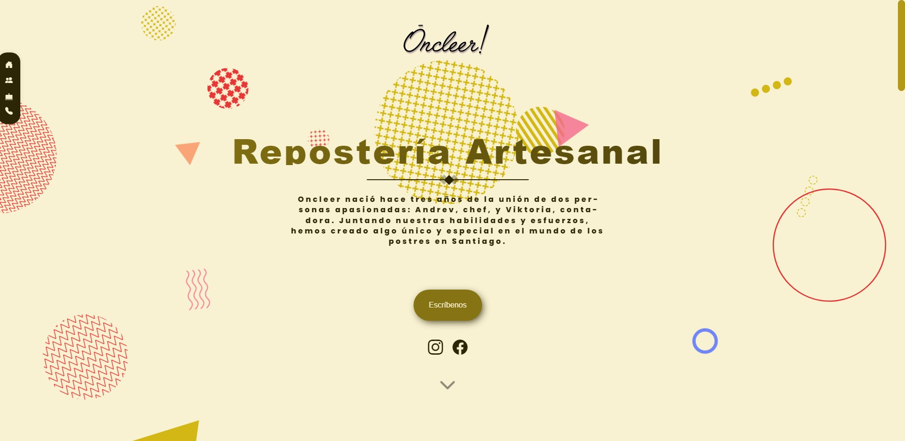

# Oncleer - Artisan Bakery



### Structures

```text
app/
├─ public
│  └─ assets 
│      └─ gifs  // app gifs
│      └─ icons // app icons
│      └─ img   // app images like background images
├─ node_modules/
├─ src/
│  └─ aboutUs
│      └─ components
│      └─ data
│      └─ pages
│      └─ About.css
│  └─ Cakes
│      └─ components
│      └─ data
│      └─ pages
│      └─ Cakes.css
│  └─ Home
│      └─ components
│      └─ hooks
│      └─ pages
│      └─ Home.css
│  └─ router
│      └─ AppRouter.tsx
│  └─ ui
│      └─ components
│      └─ data
│      └─ hooks
│      └─ Navbar.css
│      └─ ScrollTop.css
│  └─ App.tsx
│  └─ index.css
│  └─ main.tsx
│  └─ vite-env.d.ts.tsx
├─ .gitignore
├─ index.html
├─ netlify.toml
├─ package.json
├─ README.md
├─ tsconfig.json
├─ tsconfig.node.json
├─ vite.config.ts
└─ yarn.lock
```

### Install and running the project

Installing and running the project is as simple as running

```sh
yarn && yarn dev
```

- Note that we recommend using yarn.

This runs the `dev` script specified in our `package.json`, and will spawn off a server which reloads the page as we save our files.
Typically the server runs at `http://127.0.0.1:5173/`, but should be automatically opened for you.


